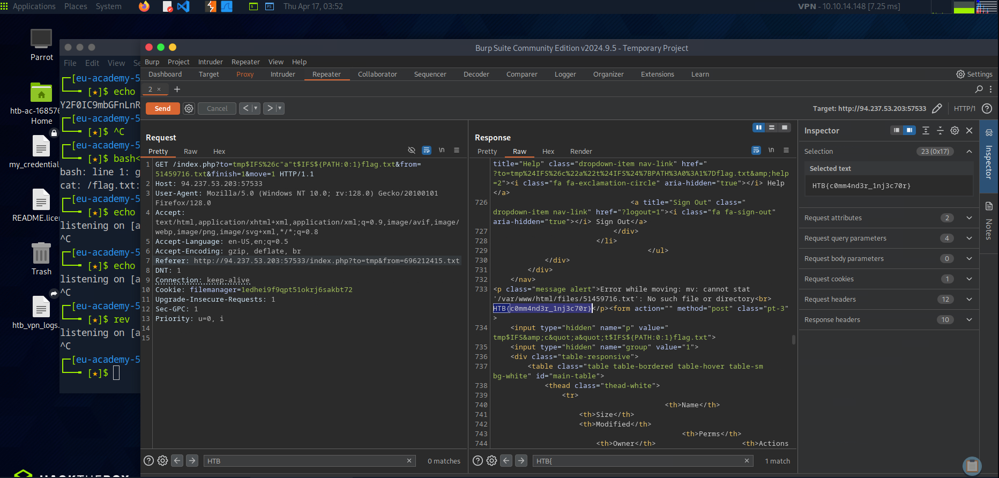
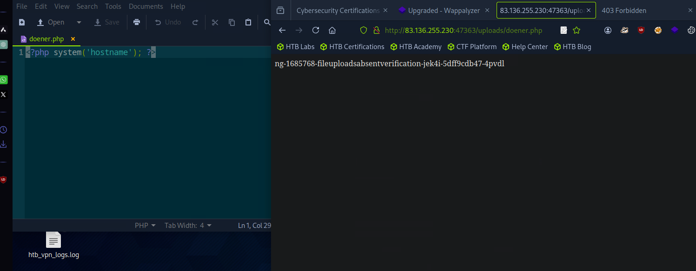
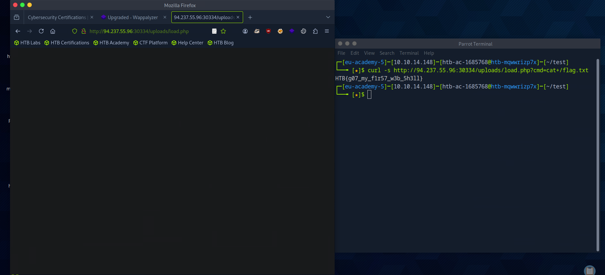
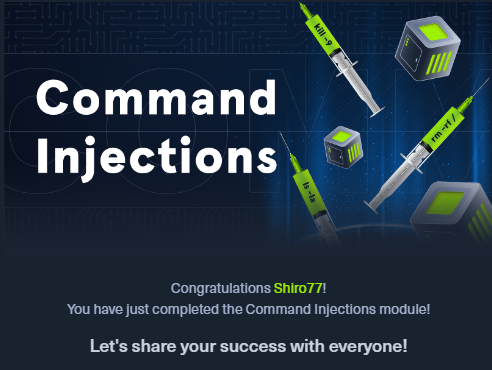

# 🧠 Daily Log - April 17, 2025

## 🔥 Focus
Mastering **Command Injection** attacks, completing the full module on HTB Academy.

## 🛠️ What I Did
- Practiced **advanced command injection** payloads and bypasses:
  - Used `${IFS}` and `${PATH:0:1}` tricks to manipulate file paths.
  - Abused PHP file upload vulnerabilities to plant backdoors.
  - Crafted and executed `system('hostname')` via malicious uploads.
- Successfully grabbed multiple flags by executing obfuscated commands remotely.
- Fully completed the **Command Injections** module on HTB Academy.

## 🧠 Lessons Learned
- **Command injection** isn't always about direct command input — file path manipulation is lethal too.
- **PHP upload vulnerabilities** are a goldmine for remote code execution if filters are weak.
- Always check for filename-based injections and bypass common extension checks.

## 📸 Screenshots
- 
- 
- 
- 

## ✅ Summary
- Mastered command injection techniques.
- Practiced real-world exploitation scenarios.
- Secured certification of completion for the Command Injection module.
