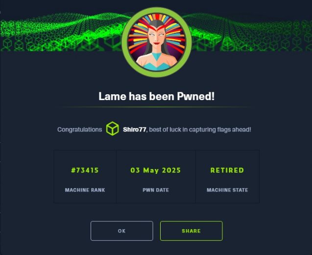

# 🧠 Daily Log – May 3, 2025

## 🏆 Milestone
Pwned my **first real Hack The Box (HTB) ranked machine**: `Lame`  
Mode: **Adventure** (no hints, full send)

## ✅ What I Accomplished
- 🎯 Exploited **Samba 3.0.20** manually and via **Metasploit** for root shell.
- 🔄 Learned **FTP passive mode** mechanics; switched to `lftp` for better handling.
- 💣 Went deep into **`msfconsole` usage**, payload crafting, and how it aligns with (and breaks under) OSCP restrictions.
- 🎯 Broke into **HTB global Top #900** by completing just one legit ranked box.
- 🧠 Realized that most users **never finish a single box**, and that every complete box is a true upper-percentile W.

## ✅ Summary
- First legit HTB pwn locked in.
- Grew technically and mentally in one sitting.
- OSCP mindset deeper than ever — no flukes, no shortcuts.

## 🖼️ Proof of Pwn

